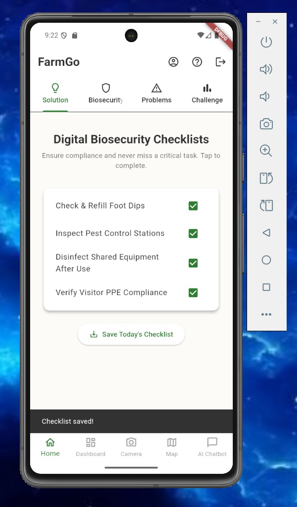
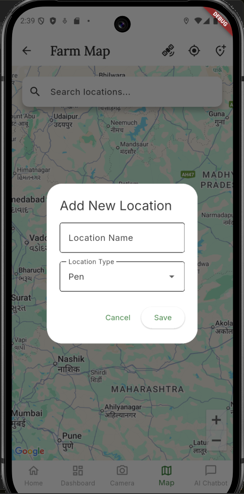

# 🌾 FarmGo - Smart Farm Management App

A comprehensive biosecurity and farm management solution for poultry and pig farms.

## Features
- 🤖 AI-powered chatbot for farming advice (Google Gemini)
- 📊 Farm data tracking and analytics
- 🗺️ Interactive farm location mapping
- 📸 AI fecal analysis for disease detection
- 📋 Digital biosecurity checklists
- 📈 Visual data dashboards

## Quick Start

See [SETUP.md](SETUP.md) for detailed setup instructions.

\`\`\`bash
# Clone, install, and configure
git clone https://github.com/SachiTiwari04/FarmGO-App.git
cd farm_go_app
flutter pub get
cp .env.example .env
# Edit .env with your API keys
flutter run
\`\`\`

## Tech Stack
- **Framework**: Flutter
- **Backend**: Firebase (Auth, Firestore, Storage)
- **AI**: Google Gemini API
- **Maps**: Google Maps Platform
- **State Management**: Provider

## Screenshots

